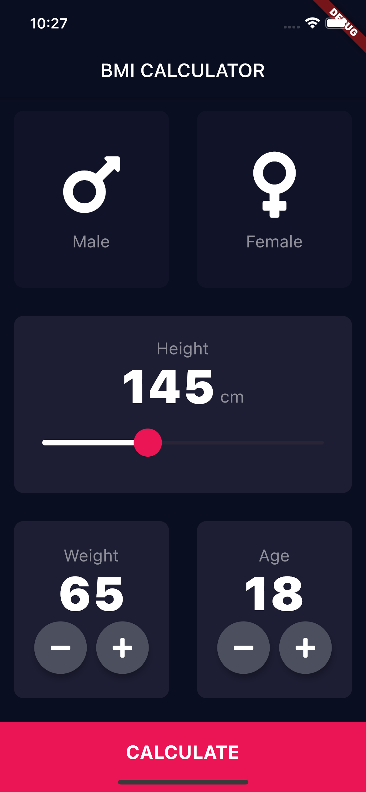
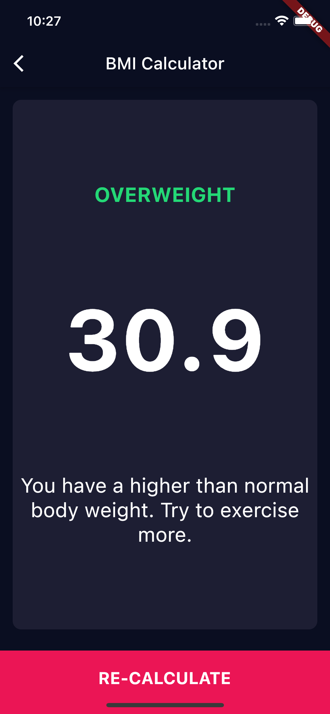

# Flutter BMI Calculator

Here is a simple BMI Calculator implemented with Flutter.

## How to run?

* Open the project in your IDE (i.e. VS Code)
* Install the packages
* Run the emulator (or connect your phone)
* Click on Run (with Debug)

## How does it look?

## Disclaimer

This app was created as a demo for the Flutter course of [www.appbrewery.co](https://www.appbrewery.co/).
